# Kairos Production Plan

Kairos is the TV break revenue optimization product built on top of the Meridian
modeling work in this repository. The production target is a workflow tool for
broadcast revenue operations: optimize break placement, inspect guardrails,
approve recommendations, and export a traffic-ready plan.

## Current Architecture

```mermaid
flowchart LR
  source["TV source files\nDayparts / Programmes / Spots"] --> transform["TVBreakDataTransformer"]
  transform --> meridian["Meridian InputData\nbreak seconds as media signal"]
  meridian --> train["TVBreakModel\nposterior training"]
  train --> model["models/tv_break_posterior.pkl"]
  model --> optimize["run_optimization.py\nplanning + allocation"]
  optimize --> outputs["output/*.csv / *.json"]
  outputs --> api["kairos_api.server\nFastAPI operational API"]
  api --> dashboard["tv-break-dashboard\nVite + React"]
```



## Product Stack

- Backend API: FastAPI, chosen for typed request models, OpenAPI, and low
  startup cost. The API reads existing reports quickly and runs optimization as
  an explicit action.
- Model pipeline: Python + Meridian + TensorFlow in a dedicated Python 3.11/3.12
  environment. Do not run training on Python 3.13.
- Frontend: Vite + React with a local design system. No heavy UI kit is used;
  the product surface is custom because Kairos needs a precise planning canvas,
  inspector, and guardrail workflow rather than a generic BI dashboard.
- Charts: code-native SVG/HTML for the current frontier and heatmap. Add a chart
  library only when exploration requirements exceed these native components.

## `meridian_ui` Repository Review

The older `QuestoM/meridian_ui` repository was useful for product archaeology,
but not as a codebase to merge wholesale. It used CRA, MUI, Redux Toolkit, a
Flask API, and in-memory state. The reusable product ideas were:

- manual break CRUD and AI-generated break proposals
- a settings drawer for commercial controls
- timeline and table views for traffic teams
- explicit schedule/settings API contracts

Kairos keeps those concepts while using the newer Vite + React dashboard and
FastAPI backend in this repository. The old UI implementation should not be
copied directly because it is heavier, less production-ready, and encoded Hebrew
text in several places is corrupted.

## Israel Market Settings

Kairos should not hard-code mutable regulatory or broadcaster policy values.
The active baseline lives in `data/kairos_settings.json` and is exposed through
`GET/PUT /api/settings`. The API also exposes `GET /api/compliance`, which
evaluates the current schedule against the active profile.

Current controls include:

- maximum ad minutes per broadcast hour
- maximum breaks per hour
- minimum spacing between breaks
- viewer-retention floor
- protected programme types and protected-content ad load
- daily ad-minute cap
- sponsorship, gold-break, and manual-approval switches

The application shell supports Hebrew RTL. Analytical charts and heatmaps remain
LTR by design, which matches common professional usage in Israeli BI and TV
operations tools.

## Local Run

```powershell
pip install -r requirements-api.txt
cd tv-break-dashboard
npm install
cd ..
python -m uvicorn kairos_api.server:app --host 127.0.0.1 --port 8000
```

In a second terminal:

```powershell
cd tv-break-dashboard
npm run dev -- --port 3000
```

Open `http://127.0.0.1:3000/`.

Use `requirements.txt` instead of `requirements-api.txt` only for the full
Meridian model/training environment.

## Production Readiness Gaps

- Model environment: create a locked Python 3.11/3.12 environment with
  TensorFlow, TensorFlow Probability, xarray, and Meridian dependencies. The
  current desktop Python is 3.13 and cannot be the production training runtime.
- Data contracts: freeze schemas for `Dayparts`, `Programmes`, `Spots`,
  `rate_card_premiums`, and `advertiser_rules`; reject unknown critical columns.
- Optimization quality: replace the current simple allocation fallback with a
  calibrated optimization objective that explicitly balances revenue, retention,
  ad inventory, contract rules, and programme protection.
- Persistence: move run metadata and approvals into a database. CSV output is
  acceptable for smoke tests, not for production auditability.
- Auth and roles: add SSO, role-based approvals, and export permissions before
  any customer deployment.
- Observability: add structured run logs, model version IDs, input checksums,
  and optimization trace files for every run.
- QA: add unit tests for revenue math, transformer edge cases, API responses,
  and UI interaction tests for approval/export flows.

## Deployment Shape

- API service: containerized FastAPI behind a private network/API gateway.
- Model runner: separate job worker for training and optimization, not the web
  process.
- Frontend: static Vite build served via CDN or the same gateway.
- Storage: object storage for source files and artifacts, Postgres for run state
  and approval history.
