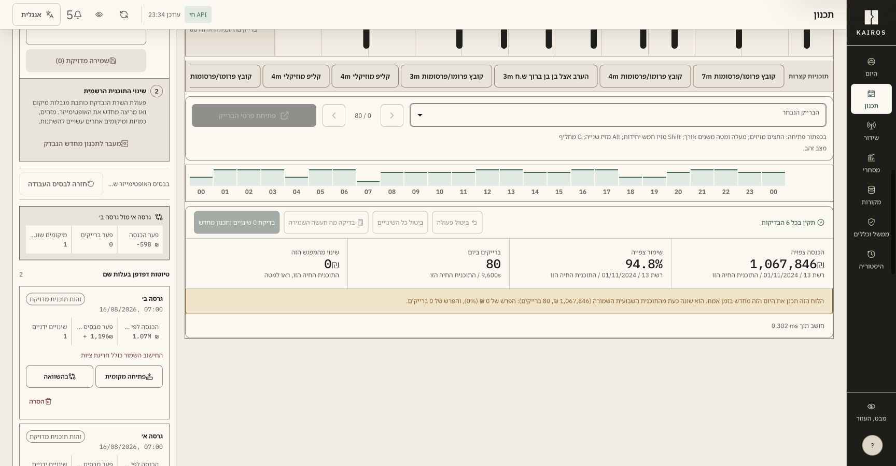
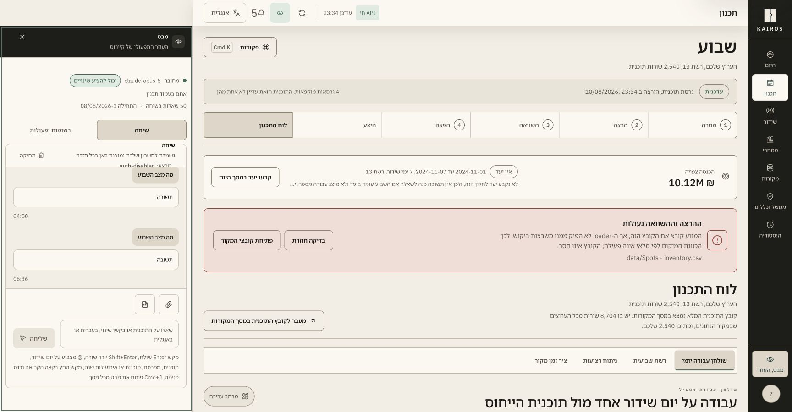
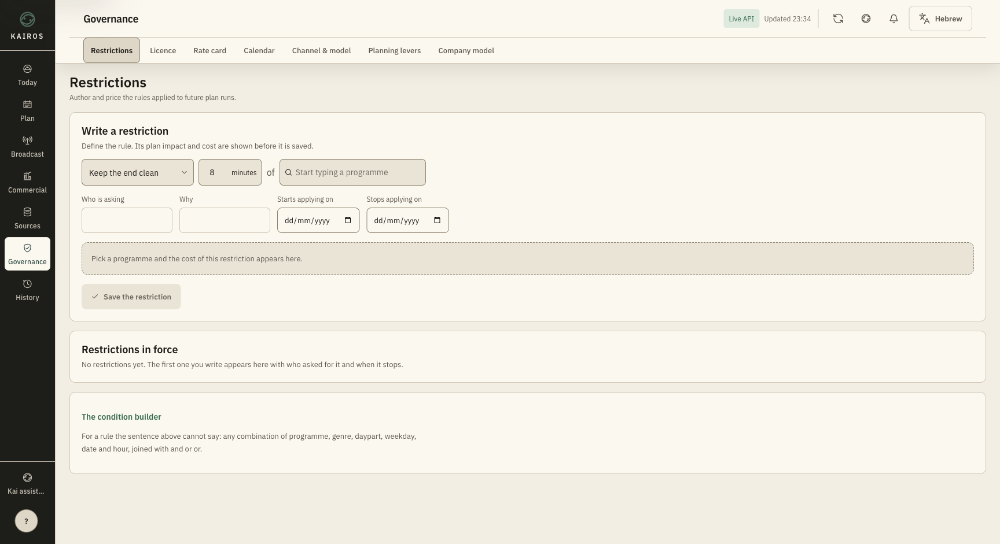
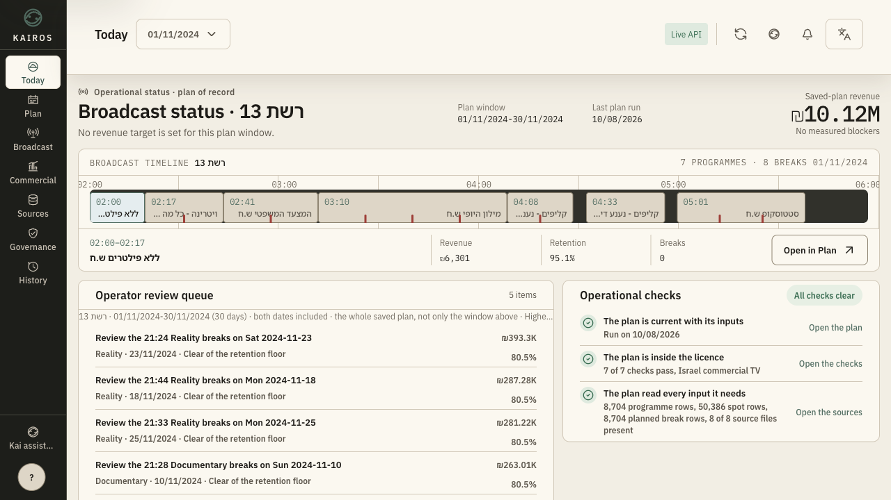
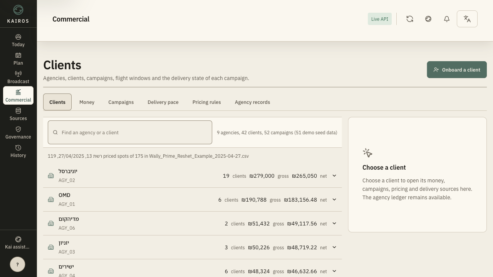
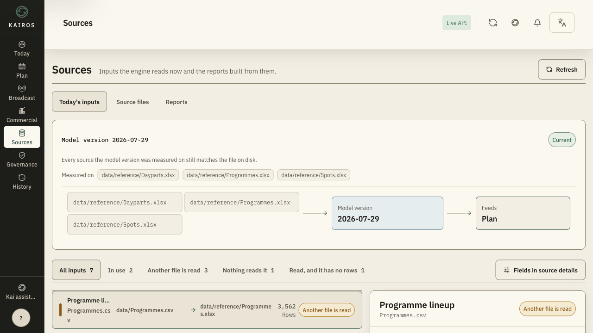
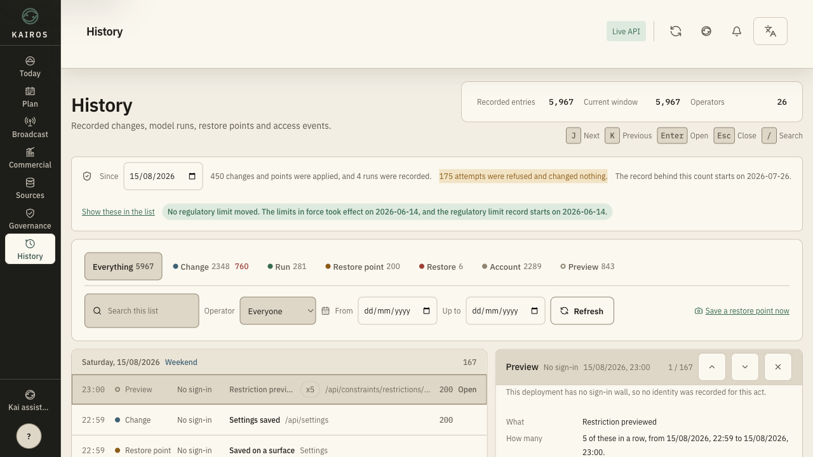
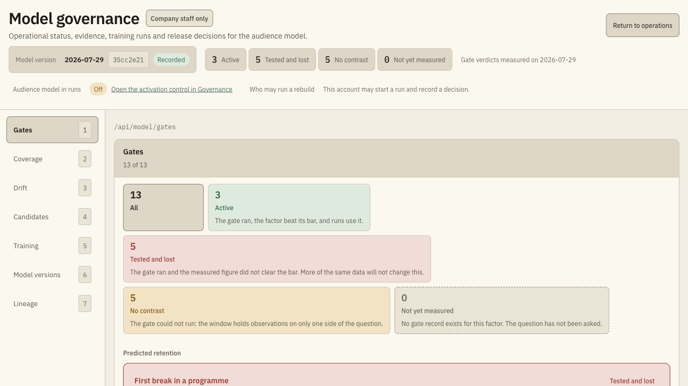
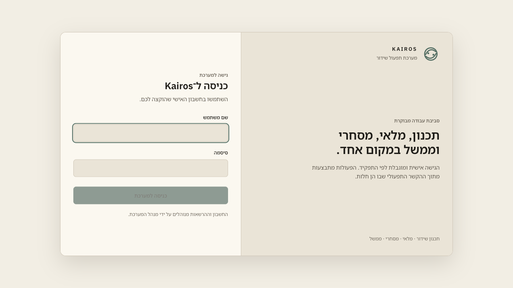
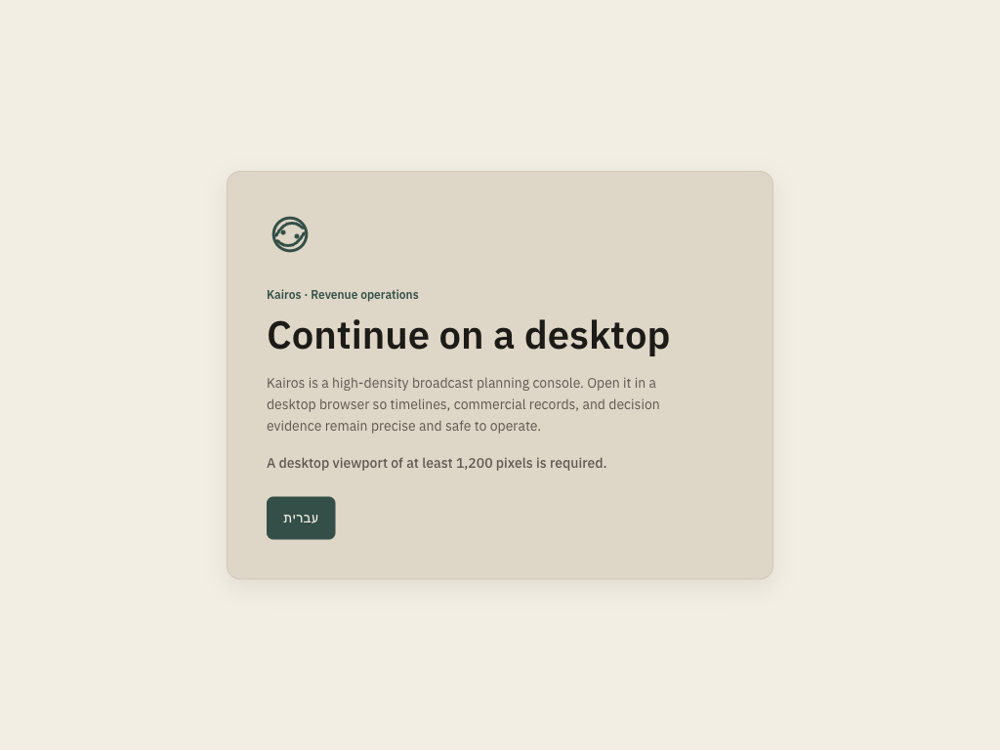

# Kairos UX overhaul evidence gallery

Evidence captured on 15–16 August 2026. The repository currently contains 149 baseline PNGs and 1,275 after-state PNGs. The count retains the earlier canonical matrix as an audit snapshot; the current `final-cream-matrix-v2` alone contributes 552 screenshots: 34 canonical routes × 2 languages × 2 desktop sizes × 4 full/top/middle/bottom views, plus the localized desktop gate at 1024×768.

## Read this gallery correctly

There are three evidence generations, and they prove different things:

1. **Baseline** — the original product, including long full pages, critical flows, login/error, English control, and the broken narrow layout.
2. **Structural after-state** — complete route and section coverage after the information-architecture and interaction rebuild. These captures predate the user's final palette correction, so they prove layout, task decomposition, and capability coverage—not the final colour direction.
3. **Final cream matrix** — every canonical route after the final palette and multilingual typography correction, in Hebrew/RTL and English/LTR at 1280×720 and 1728×900, with full-page and top/middle/bottom views. This proves complete canonical visual capture; interaction states outside the route cold-load remain a separate boundary.

This distinction is deliberate. An older dark structural capture is never presented here as the final visual state.

## Final-cream canonical matrix

The [aggregate report](./evidence/after/final-cream-matrix-v2/aggregate.md) records a 34/34-route, 136/136-desktop-capture pass with 552/552 screenshots including the gate. The [JSON ledger](./evidence/after/final-cream-matrix-v2/aggregate.json) carries the exact route, locale, viewport, network, layout, target, contrast, motion, and font evidence. Representative wide full pages are linked here; every route report links to the same stable directory structure.

| Domain | Hebrew / RTL | English / LTR |
| --- | --- | --- |
| Today | [HE full](./evidence/after/final-cream-matrix-v2/today/he/1728x900/full.png) | [EN full](./evidence/after/final-cream-matrix-v2/today/en/1728x900/full.png) |
| Plan | [HE full](./evidence/after/final-cream-matrix-v2/plan-objective/he/1728x900/full.png) | [EN full](./evidence/after/final-cream-matrix-v2/plan-objective/en/1728x900/full.png) |
| Broadcast | [HE full](./evidence/after/final-cream-matrix-v2/broadcast-day/he/1728x900/full.png) | [EN full](./evidence/after/final-cream-matrix-v2/broadcast-day/en/1728x900/full.png) |
| Commercial | [HE full](./evidence/after/final-cream-matrix-v2/commercial-pacing/he/1728x900/full.png) | [EN full](./evidence/after/final-cream-matrix-v2/commercial-pacing/en/1728x900/full.png) |
| Sources | [HE full](./evidence/after/final-cream-matrix-v2/sources-inputs/he/1728x900/full.png) | [EN full](./evidence/after/final-cream-matrix-v2/sources-inputs/en/1728x900/full.png) |
| Governance | [HE full](./evidence/after/final-cream-matrix-v2/governance-restrictions/he/1728x900/full.png) | [EN full](./evidence/after/final-cream-matrix-v2/governance-restrictions/en/1728x900/full.png) |
| History | [HE full](./evidence/after/final-cream-matrix-v2/history/he/1728x900/full.png) | [EN full](./evidence/after/final-cream-matrix-v2/history/en/1728x900/full.png) |
| Company Model | [HE full](./evidence/after/final-cream-matrix-v2/model-gates/he/1728x900/full.png) | [EN full](./evidence/after/final-cream-matrix-v2/model-gates/en/1728x900/full.png) |
| Desktop gate | [HE full](./evidence/after/final-cream-matrix-v2/desktop-gate/he/1024x768/full.png) | [EN full](./evidence/after/final-cream-matrix-v2/desktop-gate/en/1024x768/full.png) |

## Final direction and reference interpretation

- The visual target is an authoritative broadcast-operations product: calm density, high information trust, and exact consequence handling. It is not a decorative marketing site.
- [Fable25 Hub](https://fable25-hub.netlify.app/) set the **craft ceiling**—finish, completeness, and confidence—not the decorative language to copy.
- The local REDLINE `/he/ops` reference was specifically about **Hebrew typography and font fit**, not its copywriting voice.
- The accepted palette combines a warm cream canvas (`#f2eee4`), near-black ink/chrome (`#1d1b17` / `#1d1e1a`), and restrained mineral sage (`#526d62`). The requested anthroposophic quality is expressed as material warmth and humane rhythm, not ornament or whimsical geometry.
- The sharp black/white alternative remains present as the high-contrast near-black rail and ink. Pure black and pure white were not introduced.
- Mobile and tablet operational layouts are intentionally not designed. Below 1,200px, the product gives a clear localized desktop-required gate.

## Current cream/black visual system

### Final goal spot checks

| Exact manual Plan comparison | Connected Mabat dock |
| --- | --- |
|  |  |

The Plan capture is a non-writing browser-local flow: two named exact arrangements were stored, compared, opened locally, and returned to the captured optimizer baseline. The Mabat capture follows a successful provider-status check and a one-token Claude Max OAuth request; no API-key billing path was selected.

### Governance — current final palette

This is the strongest current route-level palette proof: a restrained near-black rail, warm material canvas, low-noise boundaries, obvious controls, and mineral sage reserved for live/focus/state meaning.

### Core operator routes

| Today | Plan objective |
| --- | --- |
|  |  |

| Commercial clients | Sources inputs |
| --- | --- |
|  |  |

| History | Company Model |
| --- | --- |
|  |  |

### Authentication and unsupported canvas

| Controlled login | Desktop-required gate |
| --- | --- |
|  |  |

The final gate was captured on a true cold load at 1024×768 with outer and screen widths also emulated to 1024px. Its H1 was `Continue on a desktop`, and the Performance Resource Timing API reported an empty API resource list: neither authentication nor operational data trees mounted.

## Hebrew and English typography proof

The current pairing is script-specific: Noto Sans Hebrew Variable supplies Hebrew glyphs only; IBM Plex Sans supplies Latin and figures; IBM Plex Mono supplies identifiers. Hebrew headings, controls, table labels, and statuses explicitly remove Latin display tracking and transforms. Numerals remain tabular where they align.

| Route | Hebrew/RTL | English/LTR |
| --- | --- | --- |
| Today | [1280px capture](./evidence/after/cream-typography-he-today-1280.png) | [1280px capture](./evidence/after/cream-typography-en-today-1280.png) |
| Plan | [1280px capture](./evidence/after/cream-typography-he-plan-1280.png) | [1280px capture](./evidence/after/cream-typography-en-plan-1280.png) |
| Governance | [1280px capture](./evidence/after/cream-typography-he-governance-1280.png) | [1280px capture](./evidence/after/cream-typography-en-governance-1280.png) |

These six files use a `.png` name for the established evidence convention; file inspection identifies their encoded content as JPEG. Browsers render them correctly, but future automation should align extension and encoding.

## Complete canonical route gallery

Every structural after-state full page has three sibling section captures named `-section-01-top`, `-section-02-middle`, and `-section-03-bottom`. The table links the full-page capture and the most comparable baseline evidence.

### Today and Plan

| Current surface | Baseline | Structural after-state | Comparison note |
| --- | --- | --- | --- |
| Today | [Overview](./evidence/before/overview-wide-full.png) | [Today](./evidence/after/today-wide-full.png) | Like-for-like daily operating surface |
| Plan · Objective | [Optimizer](./evidence/before/optimizer-wide-full.png) | [Objective](./evidence/after/plan-objective-wide-full.png) | Recommendation evidence is now present at the destination |
| Plan · Run | [Optimizer Run, settled](./evidence/before/optimizer-run-settled-wide-full.png) | [Run](./evidence/after/plan-run-wide-full.png) | Same run step, isolated from hidden sibling panels |
| Plan · Compare | [Forecasts](./evidence/before/forecasts-wide-full.png) | [Compare](./evidence/after/plan-compare-wide-full.png) | Legacy entrance consolidated into Plan |
| Plan · Publish | [Optimizer Publish, settled](./evidence/before/optimizer-publish-settled-wide-full.png) | [Publish](./evidence/after/plan-publish-wide-full.png) | Same version/publish capability with consequence controls |
| Plan · Supply | [Inventory](./evidence/before/inventory-wide-full.png) | [Supply](./evidence/after/plan-supply-wide-full.png) | Legacy entrance consolidated into Plan |
| Plan · Week board | [Schedule](./evidence/before/schedule-wide-full.png) | [Week board](./evidence/after/plan-board-wide-full.png) | Legacy entrance consolidated into Plan |

### Broadcast

| Current surface | Baseline | Structural after-state | Comparison note |
| --- | --- | --- | --- |
| Day timeline | [Overrides](./evidence/before/overrides-wide-full.png) | [Day](./evidence/after/broadcast-day-wide-full.png) | Day editing separated from manual-decision composition |
| Traffic pods | [Break Library](./evidence/before/break-library-wide-full.png) | [Pods](./evidence/after/broadcast-pods-wide-full.png) | Pod truth no longer competes with library and day table |
| Break library | [Break Library](./evidence/before/break-library-wide-full.png) | [Library](./evidence/after/broadcast-library-wide-full.png) | Ranked-plan level isolated as its own context |
| Manual decisions | [Overrides](./evidence/before/overrides-wide-full.png) | [Decisions](./evidence/after/broadcast-decisions-wide-full.png) | Pin/forbid/count/gold decisions isolated from timeline editing |

### Commercial

| Current surface | Baseline | Structural after-state | Comparison note |
| --- | --- | --- | --- |
| Clients | [Campaigns](./evidence/before/campaigns-wide-full.png), [Advertisers](./evidence/before/advertisers-wide-full.png), [Agencies](./evidence/before/agencies-wide-full.png) | [Clients](./evidence/after/commercial-clients-wide-full.png) | New consolidated master/detail view; no one-to-one baseline screen existed |
| Money | [Campaigns](./evidence/before/campaigns-wide-full.png) and [Advertisers](./evidence/before/advertisers-wide-full.png) | [Money](./evidence/after/commercial-money-wide-full.png) | New ledger grouping of previously dispersed commercial value; no one-to-one baseline screen existed |
| Campaigns | [Campaigns](./evidence/before/campaigns-wide-full.png) | [Campaigns](./evidence/after/commercial-campaigns-wide-full.png) | Like-for-like capability with progressive windows |
| Delivery pace | [Pacing flow](./evidence/before/flow-commercial-03-pacing.png) | [Pacing](./evidence/after/commercial-pacing-wide-full.png) | Baseline evidence is a flow frame, not a full-page pair |
| Pricing rules | [Advertisers](./evidence/before/advertisers-wide-full.png) | [Pricing rules](./evidence/after/commercial-advertisers-wide-full.png) | Legacy advertiser route consolidated into Commercial |
| Agency records | [Agencies](./evidence/before/agencies-wide-full.png) | [Agency records](./evidence/after/commercial-agencies-wide-full.png) | Legacy agency route consolidated into Commercial |

### Sources and Governance

| Current surface | Baseline | Structural after-state | Comparison note |
| --- | --- | --- | --- |
| Sources · Inputs | [Data](./evidence/before/data-wide-full.png) | [Inputs](./evidence/after/sources-inputs-wide-full.png) | Exact engine-read state promoted |
| Sources · Files | [Data](./evidence/before/data-wide-full.png) | [Files](./evidence/after/sources-files-wide-full.png) | Stored-file inspection separated inside Sources |
| Sources · Reports | [Reports](./evidence/before/reports-wide-full.png) | [Reports](./evidence/after/sources-reports-wide-full.png) | Legacy entrance consolidated into Sources |
| Governance · Restrictions | [Settings Restrictions](./evidence/before/settings-restrictions-wide-full.png) | [Restrictions](./evidence/after/governance-restrictions-wide-full.png) | Like-for-like rule authoring capability |
| Governance · Licence | [Settings Licence](./evidence/before/settings-licence-wide-full.png) | [Licence](./evidence/after/governance-licence-wide-full.png) | Like-for-like regulatory capability |
| Governance · Rate card | [Settings Rate Card](./evidence/before/settings-rate-card-wide-full.png) | [Rate card](./evidence/after/governance-rate-card-wide-full.png) | Like-for-like pricing capability |
| Governance · Calendar | [Settings Calendar](./evidence/before/settings-calendar-wide-full.png) | [Calendar](./evidence/after/governance-calendar-wide-full.png) | Calendar shortened and evidence opened contextually |
| Governance · Channel & model | [Settings Channel/Model](./evidence/before/settings-channel-model-wide-full.png) | [Channel & model](./evidence/after/governance-channel-wide-full.png) | Like-for-like declaration capability |
| Governance · Planning levers | [Settings Planning Levers](./evidence/before/settings-planning-levers-wide-full.png) | [Planning levers](./evidence/after/governance-levers-wide-full.png) | Like-for-like engine-parameter capability |

### History and Company Model

| Current surface | Baseline | Structural after-state | Comparison note |
| --- | --- | --- | --- |
| History | [Versions / restore](./evidence/before/versions-wide-full.png) | [History](./evidence/after/history-wide-full.png) | Audit timeline and restore capability consolidated |
| Model · Gates | [Model Gates](./evidence/before/model-console-gates-wide-full.png) | [Gates](./evidence/after/model-gates-wide-full.png) | Like-for-like company-side surface |
| Model · Coverage | [Model Coverage](./evidence/before/model-console-coverage-wide-full.png) | [Coverage](./evidence/after/model-coverage-wide-full.png) | Like-for-like company-side surface |
| Model · Drift | [Model Drift](./evidence/before/model-console-drift-wide-full.png) | [Drift](./evidence/after/model-drift-wide-full.png) | Like-for-like company-side surface |
| Model · Candidates | [Model Candidates](./evidence/before/model-console-candidates-wide-full.png) | [Candidates](./evidence/after/model-candidates-wide-full.png) | Like-for-like company-side surface |
| Model · Training | [Model Training](./evidence/before/model-console-training-wide-full.png) | [Training](./evidence/after/model-training-wide-full.png) | Like-for-like company-side surface |
| Model · Versions | [Model Versions](./evidence/before/model-console-versions-wide-full.png) | [Versions](./evidence/after/model-versions-wide-full.png) | Like-for-like company-side surface |
| Model · Provenance | [Model Provenance](./evidence/before/model-console-provenance-wide-full.png) | [Provenance](./evidence/after/model-provenance-wide-full.png) | Like-for-like company-side surface |

## Critical-flow evidence

The baseline collection also preserves the interaction states that motivated the new compositions:

- Week plan: [Run](./evidence/before/flow-week-02-run.png), [Compare](./evidence/before/flow-week-03-compare.png), and [Publish](./evidence/before/flow-week-04-publish.png).
- Broadcast day: [Board](./evidence/before/flow-day-01-board.png), [break selected](./evidence/before/flow-day-02-break-selected.png), and [break inspector](./evidence/before/flow-day-03-break-inspector.png).
- Traffic pod: [Library](./evidence/before/flow-pod-01-library.png) and [pod detail](./evidence/before/flow-pod-02-detail.png).
- Commercial: [Campaigns](./evidence/before/flow-commercial-01-campaigns.png), [campaign detail](./evidence/before/flow-commercial-02-campaign-detail.png), [pacing](./evidence/before/flow-commercial-03-pacing.png), [pacing evidence](./evidence/before/flow-commercial-04-pacing-drill.png), and [onboarding](./evidence/before/flow-commercial-05-onboarding.png).

## Remaining visual-evidence gaps

The canonical route cold-load gallery is complete in the final palette and both languages. The remaining gaps are state and interaction coverage rather than missing canonical pages:

1. Capture the current login error, forced-password-change, Mabat proposal/apply, and representative loading, error, empty, partial, overflow, and long-content states in the warm palette. The connected Mabat dock is now captured above.
2. Capture focus, keyboard traversal, dialog opening/return, forced-colour, and zoom states; the matrix deliberately navigates and scrolls without clicking write-capable product controls.
3. Pair Commercial Clients, Commercial Money, and Delivery pace with an explicitly normalized baseline boundary if strict one-to-one historical comparison is required; their old capabilities were dispersed rather than represented by matching screens.

Runtime and accessibility certification status is maintained separately in [`qa-report.md`](./qa-report.md). The complete address map is in [`route-manifest.md`](./route-manifest.md).
