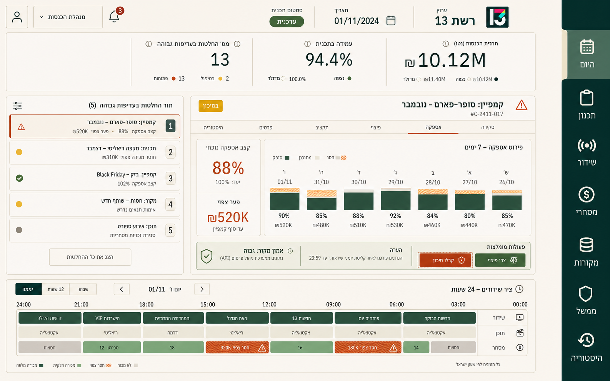
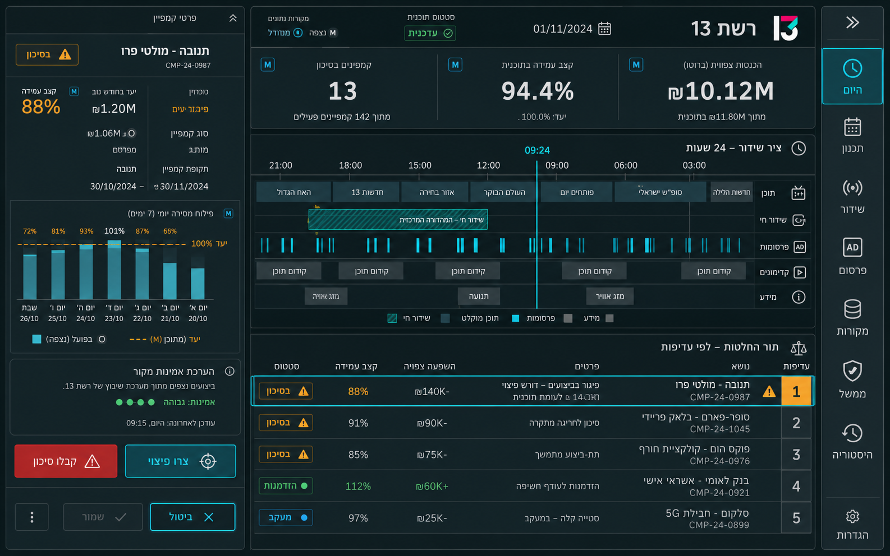
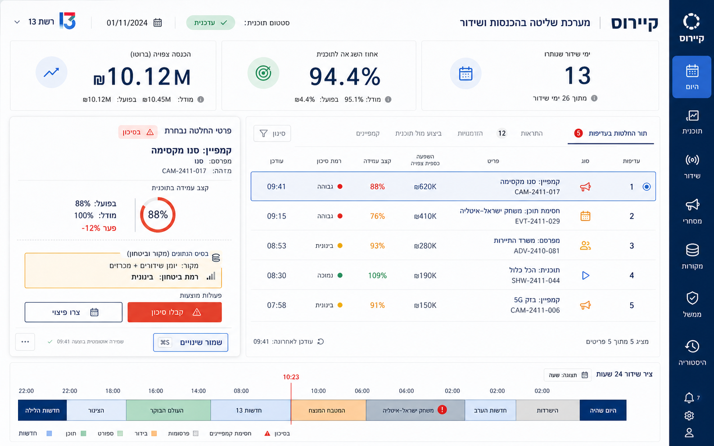

# Phase 2 — visual and interaction direction

All three directions render the same desktop surface and decision: Kairos Today for channel `רשת 13`, a weekly forecast of `₪10.12M`, retention of `94.4%`, thirteen priority decisions, a 24-hour broadcast timeline, and an open campaign-pacing edit at `88%`. That common content makes the comparison about hierarchy, interaction, and visual language rather than different feature sets.

## A — Studio Ledger

A warm editorial broadcast ledger: limestone canvas, bone work surfaces, bottle-green chrome, fired-clay action, disciplined financial numerals, and a stable list/detail editing surface.

**What succeeds:** the channel context reads immediately; the rail has only real operating domains; the three measures establish stakes without turning into interchangeable dashboard cards; the decision queue, evidence, action, and timeline coexist in one working view; the warm palette is distinctive and can travel from a live timeline to long-form Rules without becoming theatrical.

**What fails in the render:** the selected queue item uses a one-sided accent rule, which is prohibited; several fine boxes can be replaced by spacing; the generated logo is not a product asset; a few controls are still too short. These are execution corrections, not reasons to reject the direction.

## B — Signal Room

A dark petrol control room with cyan live state, amber risk, an unusually strong timeline, and a persistent evidence inspector.

**What succeeds:** it has the clearest temporal model, the selected state is unmistakable, and information density feels intentional. The campaign decision is one focused moment.

**Why it loses:** the palette overstates real-time monitoring across a product that also contains onboarding, pricing, compliance, files, and long audit evidence. Cyan outlines compete with semantic state, sustained dark reading would fatigue operators, and translating the treatment to forms and governance risks producing a themed control panel rather than a coherent business tool.

## C — Signal Paper

A cool, crisp newsroom canvas with ultramarine chrome, vermilion action, large typography, and a conventional table/detail composition.

**What succeeds:** hierarchy and scanning are immediate, the selected record reads clearly, and the structure would be straightforward to implement accessibly.

**Why it loses:** it is the least ownable. The three KPI boxes, outlined grid, circular icon halos, and blue enterprise rail feel familiar rather than inevitable for Kairos. It also relies on more borders than the information needs. It would make the product cleaner without making it singular.

## Selected direction: Studio Ledger

Studio Ledger wins because it is the only direction that can make a live broadcast decision, a commercial record, and a regulatory rule feel like parts of the same instrument. Its warmth prevents high-density data from becoming sterile; its list/detail grammar kills task scroll without hiding evidence. Production calibration replaces the concept's bottle green and fired clay with near-black chrome and a restrained mineral-sage action/focus role. It also removes the edge stripe and excess rules, enforces 44px actions, and uses the real Kairos mark. The concept's composition and material discipline survive; its decorative colour treatment does not.

## Product architecture expressed by the direction

The old fifteen-item rail becomes seven durable domains:

1. **Today** — money, health, and decisions.
2. **Plan** — Objective, Run, Compare, Publish, Supply, Week board.
3. **Broadcast** — Day timeline, Traffic pods, Break library, Manual decisions.
4. **Commercial** — Clients, Money, Campaigns, Delivery, Pricing, Agencies.
5. **Sources** — Inputs, Files, Reports.
6. **Governance** — Restrictions, Licence, Rate card, Calendar, Channel/model, Planning levers, company Model.
7. **History** — changes, versions, restore points, and recovery.

Mabat remains a contextual action/dock, not a destination. Old hashes remain valid as compatibility entrances, but the product presents one domain model. Contextual subnavigation, not duplicate global routes, addresses the work inside a domain. Route state must be shareable and Back-safe.

The canonical working composition is:

`domain rail → one-row context header/local navigation → list/board → persistent detail/edit surface`

Micro-edits happen inline or in a popover. Contextual record work uses a side sheet. One focused transaction uses a dialog. Multi-step onboarding uses a full-height workflow, never a fifty-field modal. Only the active workspace subtree is mounted.

## Foundations

### Typography

**Noto Sans Hebrew Variable + IBM Plex Sans**, with IBM Plex Mono for identifiers. The locally hosted Noto subset contains Hebrew glyphs only; IBM Plex therefore remains the deliberate source for Latin, amounts, dates, and code. This gives Hebrew the calibrated rhythm requested in the local reference without losing the stable operational numeral voice or introducing a decorative display face. IBM Plex Sans Hebrew remains a compatibility fallback.

| Role | Size / line | Weight | Measure / treatment |
| --- | --- | --- | --- |
| Micro label | 12 / 16 | 500 | Upper hierarchy only; never an action |
| Data label | 12 / 18 | 500 | Tables, provenance, compact metadata |
| UI | 13 / 20 | 500 | Dense table and secondary control copy |
| Body | 14 / 22 | 400 | Explanations, forms, detail evidence; max 68ch |
| Emphasis | 16 / 24 | 600 | Card and sheet leads |
| Section | 18 / 24 | 600 | Local page sections; balanced text |
| Page | 30 / 36 | 600 | One per workspace |
| Metric | 40 / 44 | 500 | Tabular lining numerals, tight tracking |

All numeric columns, money, percentages, dates, times, durations, and identifiers use tabular lining figures. Mixed-direction runs are isolated at the value, never by re-anchoring the containing cell. No manual ` `, non-breaking-space composition, or fixed text width is allowed.

### Colour roles

| Token | Value | Role |
| --- | --- | --- |
| `canvas` | `#F2EEE4` | Warm cream application background |
| `surface` | `#FBF8F0` | Primary working surface, never pure white |
| `surface-muted` | `#EAE4D7` | Recessed groups and disabled context |
| `surface-raised` | `#DED6C7` | Sheets, menus, focused records |
| `ink` | `#1D1B17` | Primary text, warm near-black |
| `ink-muted` | `#5D574D` | Secondary text |
| `ink-subtle` | `#625C52` | Lowest-emphasis text; text-safe on raised material |
| `line` | `#D0C7B7` | Sparse structural rules |
| `line-strong` | `#8F8572` | Input and selected boundaries |
| `chrome` | `#1D1E1A` | Stable rail and high-authority surfaces |
| `chrome-hover` | `#31312B` | Rail hover/active material |
| `accent` | `#526D62` | Mineral-sage identity, text, and focus |
| `accent-strong` | `#344F47` | Filled primary action and high-emphasis selection |
| `positive` | `#376B50` | Healthy/completed/within rule |
| `positive-soft` | `#DFEADF` | Positive surface |
| `warning` | `#8C5B18` | Risk/attention |
| `warning-soft` | `#F1E3C4` | Warning surface |
| `danger` | `#9E3F38` | Refusal/destructive/error |
| `danger-soft` | `#F2DCD7` | Error surface |
| `info` | `#3F6274` | Read-only/model/information |
| `info-soft` | `#DCE7E9` | Information surface |

Colour never carries meaning alone. Selected, risk, error, modeled, and observed states have text/icon/shape semantics. There are no pure white/black values, decorative gradients, glows, or one-sided accents.

The production palette was contrast-checked after browser calibration. `ink` is 14.84:1 on `canvas`, `ink-muted` is 6.17:1, and `ink-subtle` is 5.71:1. `ink-subtle` remains 4.59:1 on `surface-raised`; `surface` is 15.79:1 on `chrome`; `accent` is 5.32:1 on `surface`; and filled primary actions use `accent-strong` with `surface` text at 8.40:1. No component may infer a text-safe combination merely because both values are tokens.

### Spatial system

- Base grid: 4px subgrid, 8px primary rhythm.
- Steps: `2, 4, 6, 8, 12, 16, 20, 24, 32, 40, 48, 64`.
- Content max: 1,680px; supported desktop begins at 1,200 CSS px.
- Global rail: 88px compact or 96px expanded, preserving the same content alignment.
- Shell header: one 56px content row plus a 1px boundary (57px rendered). Broadcast and Governance keep their local navigation in that row rather than adding a second tier.
- Control height: 44px; icon button: 44 × 44px; compact data row: at least 48px.
- Surface inset: 20px dense, 24px standard, 32px major.
- Text measure: 42–68ch depending on role; never an arbitrary pixel width used to force wrapping.

Phone and tablet do not reflow the console. Below the desktop threshold, the app renders a complete `DesktopGate` with product name, a concise reason, the 1,200px requirement, and no operational content behind it. Acceptance covers phone/tablet portrait and landscape, Hebrew/English, zoom, and reduced-motion modes; final certification remains in the QA evidence rather than this direction document.

### Shape, elevation, and motion

- Controls: 7px radius.
- Cards and bounded data groups: 10px radius.
- Sheets/dialogs: 14px radius.
- Pills only for compact status; no pill-shaped ordinary buttons.
- Elevation 0 is the default. Elevation 1 is a warm, low-opacity two-part shadow. Elevation 2 is reserved for sheets, menus, and drag state. All shadows share one overhead light source.
- Fast response: 110ms; ordinary state/position: 180ms; sheet continuity: 260ms.
- Standard easing: `cubic-bezier(.2,.75,.25,1)`; emphasized exit: `cubic-bezier(.4,0,1,1)`.
- Motion explains cause and continuity only. Route and addressable-tab changes preserve the rail/header and acknowledge only the changed workspace, using the View Transitions API when available and the same restrained fallback otherwise. `prefers-reduced-motion` removes both animation paths while preserving the state update and destination focus.

## Canonical components

The normative component vocabulary has one owner for each purpose. The implemented public surface and remaining migration aliases are recorded in [`design-system.md`](./design-system.md):

- `Button`, `IconButton`, `LinkButton`
- `Field`, `TextArea`, `Select`, `DateField`, `NumberField`, `Range`, `Toggle`, `SegmentedControl`
- `Status`, `Badge`, `Provenance`, `Metric`
- `Surface`, `DataTable`, `DecisionList`, `DetailPanel`, `Timeline`
- `InlineEdit`, `Popover`, `Sheet`, `Dialog`, `Workflow`
- `Skeleton`, `Progress`, `EmptyState`, `ErrorState`, `PartialState`
- `Toast`, `ActivityFeed`
- `DomainRail`, `ContextHeader`, `LocalNav`, `CommandPalette`

Every component documents default, hover, focus-visible, active, selected, disabled, loading, success, warning, error, empty, long-content, bidi, and overflow behavior as applicable. A screen may compose canonical components; it may not restate their colours, radii, typography, target size, or elevation.

## Asset direction

- **Type:** a locally hosted Hebrew-only Noto Sans Hebrew Variable WOFF2 subset, plus local IBM Plex Sans and IBM Plex Mono; Noto Hebrew and IBM Plex Sans regular/semibold are preloaded; `font-display: swap`; script-specific fallbacks are explicit.
- **Icons:** Lucide remains the sole interface-icon library; canonical actions normalize its optical box and stroke while direct feature imports remain migration debt. Seven original domain glyphs share the interface grammar. The separate Kairos master mark is a transparent 32px-grid SVG made from exactly two solid `currentColor` frame paths interrupted by an off-axis negative-space splice, so it survives at small sizes without masquerading as an interface glyph, a literal `K`, a play symbol, or an equalizer.
- **Structural graphics:** timeline, pacing bars, confidence bands, skeletons, empty-state diagrams, and the logo are code/SVG. No raster image is required by the selected product direction.
- **Concept renders:** the three PNGs in `docs/ux-overhaul/concepts/` are art-direction artifacts generated from one normalized UI brief. They do not ship in the application.
